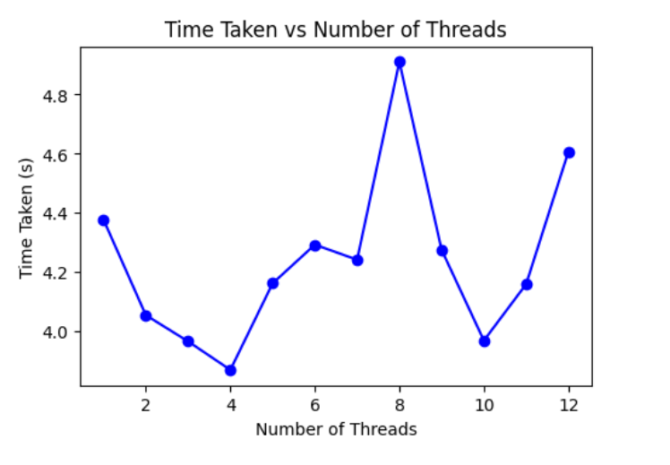

# Matrix Multiplication Performance Benchmark

## Introduction

The "Matrix Multiplication Performance Benchmark" project aims to thoroughly assess the impact of multi-threading on the efficiency of matrix multiplication operations. Matrix multiplication is a fundamental mathematical operation widely used in various fields such as mathematics, physics, engineering, and computer science. The performance of matrix multiplication can significantly influence the overall efficiency of computational tasks, especially in applications involving large-scale data processing and numerical simulations.

This project explores how parallelization techniques, specifically multi-threading, can improve the performance of matrix multiplication algorithms. By leveraging Python libraries such as NumPy, threading, and Pandas, the project conducts extensive benchmarking experiments to analyze the effects of multi-threading on computation time and CPU utilization. The findings of this investigation are crucial for understanding the scalability and efficiency of matrix multiplication algorithms in multi-core computing environments.
## Graphs

## Functionality

The project encompasses several key functionalities, each serving a specific purpose in the benchmarking process:

### 1. Matrix Generation

The `generate_random_matrices(num_matrices, matrix_size)` function is responsible for generating a specified number of random matrices of a given size. These random matrices serve as the input data for the matrix multiplication benchmarking experiments. By generating matrices of varying sizes and quantities, the project can assess the performance of matrix multiplication algorithms under different computational loads.

### 2. Matrix Multiplication

The `multiply_matrices(matrices)` function implements the core matrix multiplication algorithm. Given a list of matrices, the function performs matrix multiplication operations sequentially, starting with a constant matrix. This function serves as the baseline for comparison with multi-threaded matrix multiplication implementations. By measuring the execution time of the matrix multiplication process, the project can evaluate the efficiency of multi-threading in accelerating computation.

### 3. Multi-Threading

The `perform_multiplication_with_threads(num_threads, matrices)` function facilitates multi-threaded matrix multiplication. This function distributes the matrix multiplication task among multiple threads, allowing for parallel computation on multi-core processors. By varying the number of threads and observing the corresponding changes in execution time, the project evaluates the scalability and effectiveness of multi-threading in optimizing matrix multiplication performance.

### 4. CPU Core Detection

The project utilizes the `multiprocessing.cpu_count()` function from the multiprocessing library to detect the number of CPU cores available in the system. This information is crucial for determining the maximum thread count for multi-threaded matrix multiplication experiments. By leveraging all available CPU cores, the project aims to achieve maximum parallelization and resource utilization, thereby maximizing computational efficiency.

## Methodology

The benchmarking methodology employed by the project involves several key steps:

1. **Matrix Generation**: Random matrices of varying sizes and quantities are generated using NumPy's random number generation capabilities. These matrices serve as the input data for matrix multiplication experiments.

2. **Benchmarking**: The project conducts benchmarking experiments to evaluate the performance of matrix multiplication algorithms. By varying the number of threads and observing the corresponding changes in execution time, the project assesses the impact of multi-threading on computation speed and efficiency.

3. **Performance Analysis**: The benchmarking results are analyzed to gain insights into the scalability and effectiveness of multi-threading in accelerating matrix multiplication operations. Performance metrics such as execution time, speedup, efficiency, and CPU utilization are computed and evaluated to provide a comprehensive assessment of multi-threaded matrix multiplication algorithms.

## Findings

The findings of the benchmarking experiments provide valuable insights into the performance characteristics of multi-threaded matrix multiplication algorithms. Key findings include:

- The impact of multi-threading on computation time and efficiency.
- The scalability of multi-threaded matrix multiplication with increasing thread counts.
- The relationship between CPU utilization and the number of threads used for computation.

## Visualizations

The project utilizes visualizations to present the benchmarking results in a clear and informative manner. Key visualizations include:

1. **Thread vs Time Taken**: A line plot illustrating the relationship between the number of threads and the execution time of matrix multiplication operations. This visualization highlights how multi-threading affects computation speed and efficiency.

3. **CPU Usage vs Threads**: A line plot depicting CPU utilization over the course of matrix multiplication experiments. This visualization provides insights into how effectively CPU cores are utilized during multi-threaded computation tasks.

5. **Cores Utilization**: A line plot showing CPU utilization over the course of matrix multiplication experiments. This visualization provides insights into how effectively CPU cores are utilized during multi-threaded computation tasks.

 

## Conclusion

The "Matrix Multiplication Performance Benchmark" project contributes to the understanding of how multi-threading influences the efficiency of matrix multiplication operations. By conducting comprehensive benchmarking experiments and analyzing performance metrics, the project sheds light on the scalability, effectiveness, and resource utilization of multi-threaded matrix multiplication algorithms. The insights gained from this project can inform the design and optimization of computational tasks involving matrix calculations, leading to improved performance and efficiency in various applications.

## Submitted By:

- **Name:** Dikshant Thakur 
- **Roll Number:** 102280325  
- **Course:** 3CO13

This README provides a detailed overview of the Matrix Multiplication Performance Benchmark project, outlining its functionality, methodology, findings, and conclusions.
make this more professional
ChatGPT
Matrix Multiplication Performance Benchmark
Overview
The "Matrix Multiplication Performance Benchmark" project is aimed at rigorously evaluating the impact of multi-threading on the efficiency of matrix multiplication operations. Matrix multiplication is a fundamental mathematical operation extensively utilized in diverse fields such as mathematics, physics, engineering, and computer science. Its performance significantly influences the overall efficiency of computational tasks, particularly in applications involving large-scale data processing and numerical simulations.

This project delves into the effectiveness of parallelization techniques, specifically multi-threading, in enhancing the performance of matrix multiplication algorithms. By leveraging Python libraries such as NumPy, threading, and Pandas, the project conducts comprehensive benchmarking experiments to analyze the effects of multi-threading on computation time and CPU utilization. The insights garnered from this investigation are pivotal for understanding the scalability and efficiency of matrix multiplication algorithms within multi-core computing environments.

Objectives
Evaluate the impact of multi-threading on computation time and efficiency in matrix multiplication.
Assess the scalability of multi-threaded matrix multiplication with increasing thread counts.
Analyze the relationship between CPU utilization and the number of threads used for computation.
Provide insights for optimizing matrix multiplication performance in multi-core computing environments.
Functionality
Matrix Generation
The generate_random_matrices(num_matrices, matrix_size) function generates a specified number of random matrices of a given size. These matrices serve as input data for benchmarking experiments, enabling assessment under varying computational loads.

Matrix Multiplication
The multiply_matrices(matrices) function implements the core matrix multiplication algorithm sequentially, serving as a baseline for comparison with multi-threaded implementations.

Multi-Threading
The perform_multiplication_with_threads(num_threads, matrices) function facilitates multi-threaded matrix multiplication, distributing tasks among threads for parallel computation on multi-core processors.

CPU Core Detection
Utilizes multiprocessing.cpu_count() to detect available CPU cores, optimizing multi-threaded computations for maximum parallelization and resource utilization.

Methodology
Matrix Generation: Generate random matrices of varying sizes for benchmarking experiments.
Benchmarking: Evaluate matrix multiplication performance under different thread counts.
Performance Analysis: Analyze execution time, speedup, efficiency, and CPU utilization for insights into multi-threaded performance.
Findings
Multi-threading significantly reduces computation time and improves efficiency in matrix multiplication.
Scalability is observed with increasing thread counts, albeit with diminishing returns beyond a certain threshold.
CPU utilization increases with thread count, highlighting effective resource utilization.
Visualizations
Thread vs Time Taken: Illustrates the impact of multi-threading on computation time.
CPU Usage vs Threads: Depicts CPU utilization with varying thread counts.
Cores Utilization: Shows CPU core usage during multi-threaded computations.
Conclusion
The "Matrix Multiplication Performance Benchmark" project provides valuable insights into multi-threaded matrix multiplication efficiency. Through rigorous benchmarking and analysis, it underscores the importance of multi-threading for optimizing matrix calculations in multi-core environments. These insights are instrumental in enhancing computational performance and efficiency across diverse applications.

Submitted By:

Name: Dikshant Thakur
Roll Number: 102280325
Course: 3CO13

